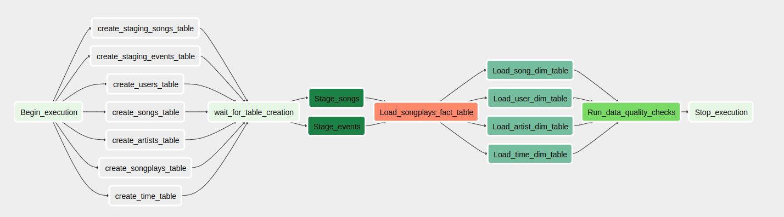

# Data Pipelines Using Apache Airflow

## Introduction
* In the previous projects, we did ETL processes
* We need something to schedule these ETL processes to run periodically or at certain events.
* Apache Airflow is one of these tools that can be used to schedule ETL processes.
* This project is about creating an ETL pipeline using Apache Airflow, to populate a DataWarehouse on AWS Redshift.

## Project Structure

### 1. DAG
* The DAG is defined in the file `dags/udac_example_dag.py`.
* The DAG is configured to run once per day, to match the frequency of the source data files, which are partitioned by date, by day
#### 1.1 DAG Stages
* I configured the DAG to have the following Stages

1. Table Creation. The SQL queris are configured to create the tables if they don't exist. So, this stage won't fail if the tables already exist.
2. Stage Events and Songs Data. This stage copies the data from the S3 bucket to the staging tables in Redshift.
3. Load Fact Table. This stage loads the data from the staging tables to the fact table.
4. Load Dimension Tables. This stage loads the data from the staging tables to the dimension tables.
5. Data Quality Check. This stage checks the data quality of the tables. It checks if the tables are empty or not. If they are empty, the DAG will fail.

### 2. Operators
* The operators are defined in the file `plugins/operators/`.
* They are used to define the tasks in the DAG, instead of relying on the PythonOperator
* The following operators are used in this project:
#### 2.1 Stage Operator
* The Stage Operator is used to copy the data from the S3 bucket to the staging tables in Redshift.
* It is defined in the file `plugins/operators/stage_redshift.py`.
* It uses the `PostgresHook` to connect to the Redshift cluster and execute the SQL queries.
#### 2.2 Data Quality Operator
* The Data Quality Operator is used to check the data quality of the tables.
* It is defined in the file `plugins/operators/data_quality.py`.
* It uses the `PostgresHook` to connect to the Redshift cluster and execute the SQL queries.
* It accepts a list of test cases, represented as a list of tuples. The first element is the SQL query to run, and the second element is the expected result.
* The operator will fail if the actual result doesn't match the expected result.
#### 2.3 Load Fact and Dimension Tables Operators
* The Load Fact and Dimension Tables Operators are used to load the data from the staging tables to the fact and dimension tables.
* They are defined in the file `plugins/operators/load_fact.py` and `plugins/operators/load_dimension.py`.
* They use the `PostgresHook` to connect to the Redshift cluster and execute the SQL queries.

### 3. SQL Queries
* The SQL queries are defined in the file `plugins/helpers/sql_queries.py`.
* They are used by the DAG and the operators to execute the SQL queries.

## How to Run the Project
### 1. AWS infrastructure
* Create a Redshift Cluster on AWS, and configure the network settings to allow access to the cluster from outside the VPC.
* Create an IAM Role that has access to S3.
### 2. Airflow
* Install Apache Airflow 1.10
* Add a Connection of type `Amazon Web Services` with the following details:
    * Conn Id: `aws_credentials`
    * Login: IAM Role Access Key
    * Password: IAM Role Secret Key
* Add a Connection of type `Postgres` with the following details:
    * Conn Id: `redshift`
    * Host: Redshift Cluster Endpoint
    * Schema: `dev`
    * Login: Redshift Cluster Username
    * Password: Redshift Cluster Password
    * Port: `5439`
* Either Copy the files in the `plugins` folder to the `plugins` folder in the Airflow installation directory, or change the directories in the `$AIRFLOW_HOME/airflow.cfg` file to point to the `plugins` folder in this project.

### Disclaimer
* I personally used the environment on Udacity Workspace. I faced some problems when setting up Airflow on my machine, so I used the Udacity Workspace instead.

## TODOs
* Use Infrastructure as Code to create the AWS infrastructure, like Terraform or Pulumi.